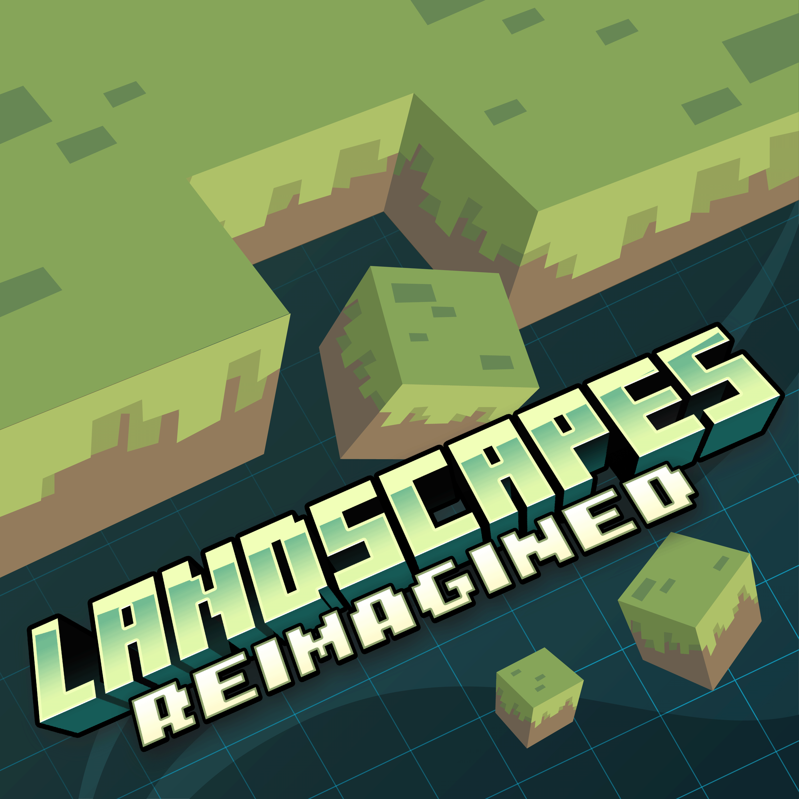

<div align="center">
  
  <h1>Landscapes Reimagined – Issues & Suggestions</h1>
  <p>Submit issues, bugs, and suggestions for the Landscapes Reimagined ecosystem.</p>
</div>

---

# Overview
This repository is the official hub for:
- Landscapes Reimagined modpacks
- Connected/maintained mods
- Discord server feedback

---

# When to Create an Issue
Use this repository when encountering:
- Gameplay or technical bugs  
- Crashes  
- Recipe, texture, or quest problems  
- Mod-specific issues  
- Worldgen or progression inconsistencies  

For ideas or improvements, submit a **suggestion** instead.

---

# Submitting an Issue or Suggestion
Click **New Issue** and select the appropriate form:

## Modpack Issue
Report problems affecting an entire modpack.  
You will select:
- Project  
- Issue subtype  
- Version  
- Description  
- Steps to reproduce  

## Modpack Suggestion
Suggest improvements for:
- Textures  
- Recipes  
- Features  
- Quests  
- General QOL  

## Mod Issue
Report issues tied to a specific mod.

## Mod Suggestion
Suggest new features or improvements for a mod.

## Discord Suggestion
Suggest improvements to:
- Channels  
- Layout  
- Supporter benefits  
- Organizational structure  

---

# Label Color Scheme

## Type Labels
```
Type: Bug — #D73A4A
Type: Suggestion — #1F6FEB
```

## Area Labels
```
Area: Modpack — #2EA043
Area: Mod — #2EA043
Area: Discord — #2EA043
```

## Project Labels
(All use #A371F7)

## Subtype Labels
```
Texture — #7DA0C8
Recipe — #A68A6D
Crash — #C98A4B
Quest — #7A9E6C
Feature — #A39BD1
Channel — #6F7EAA
Layout — #8D8276
Supporter Benefit — #C9B458
Other — #6E7781
```

## Status Labels
```
Status: Needs Triage — #FBCA04
Status: In Progress — #F9D900
Status: Blocked — #B60205
```

---

# Thank You
Your reports and suggestions directly help improve the Landscapes Reimagined experience.
